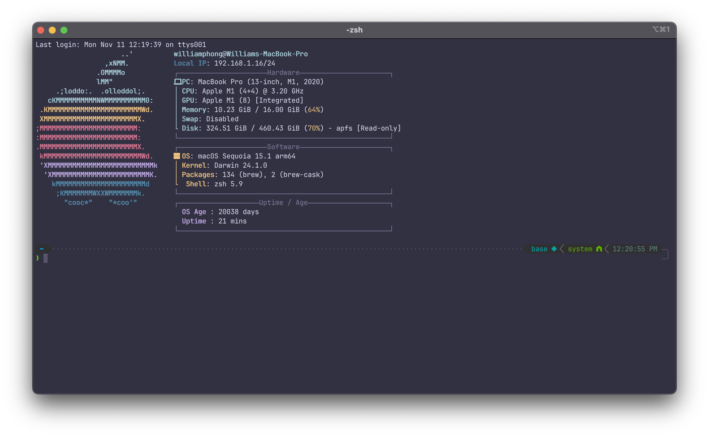
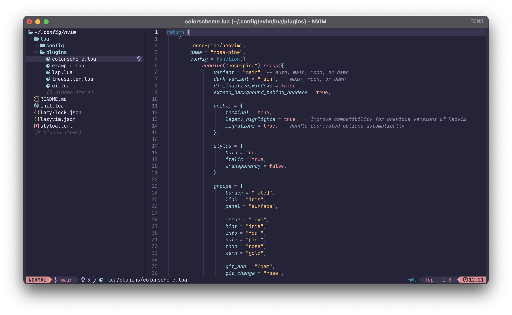
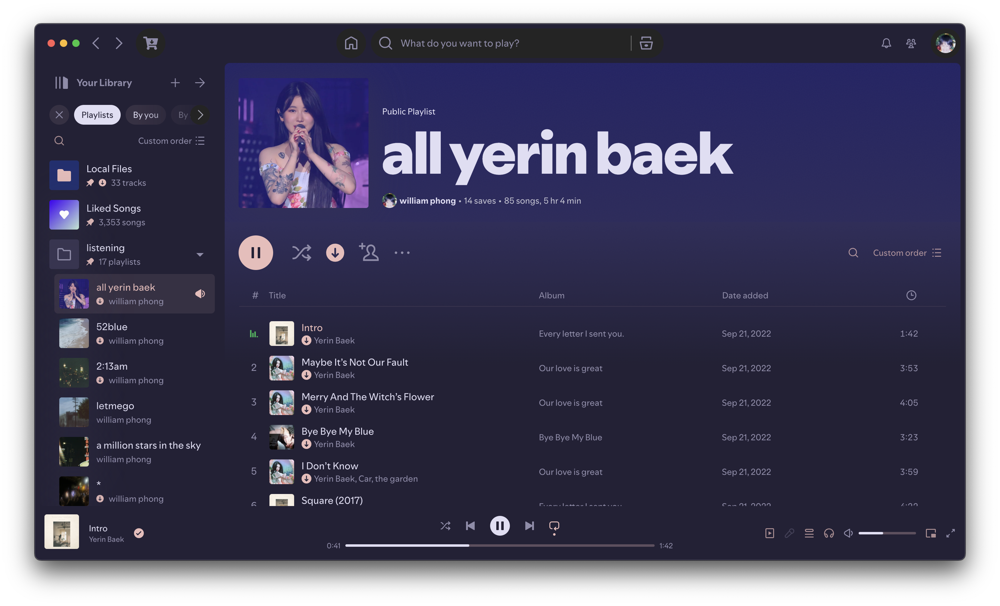
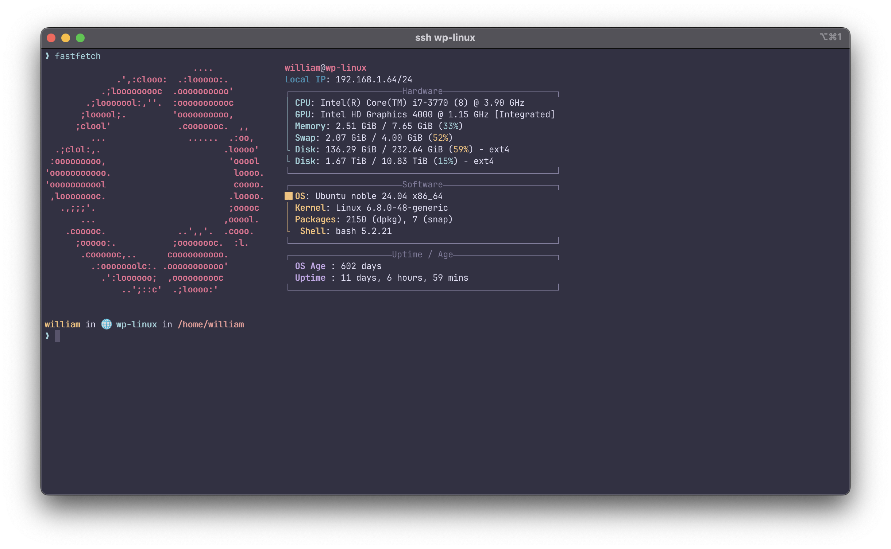

# my dotfiles

These are my dotfiles that I use to setup my MacBook and Ubuntu server.

## Contents

- my `NeoVim` setup utilizing LazyVim
- my `bashrc` config, containing starship and ble.sh
- my `zshrc` config
- my `Powerlevel10k` config
- my `Starship` config
- my `Fastfetch` config
- my `btop` config
- my `spicetify` setup

## iTerm2 / fastfetch / p10k

## Neovim

## Spicetify

## Linux

