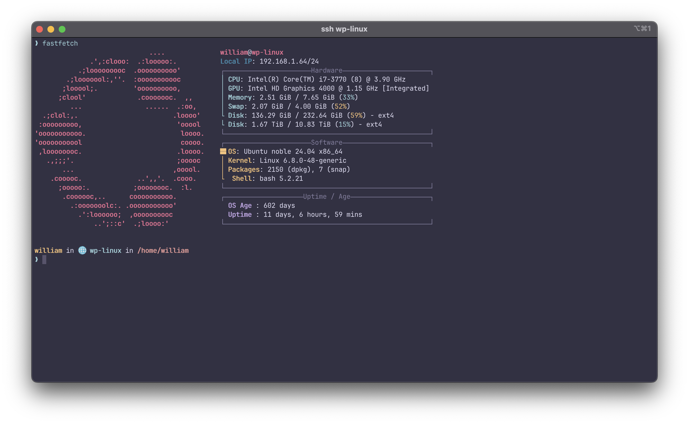
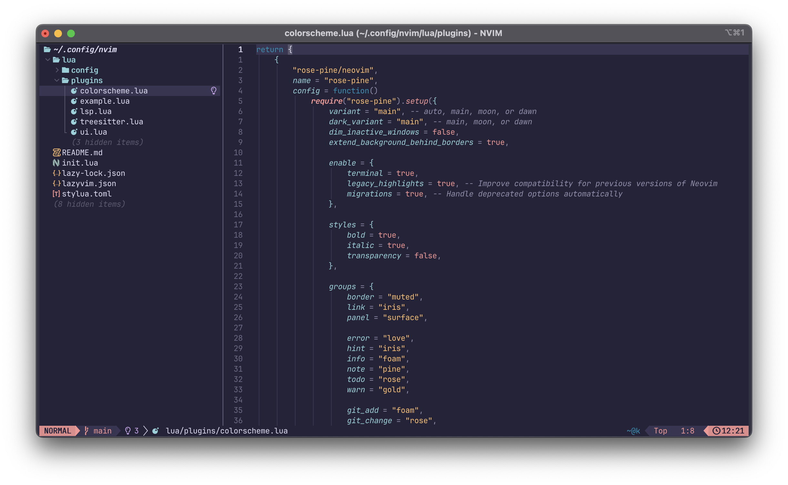
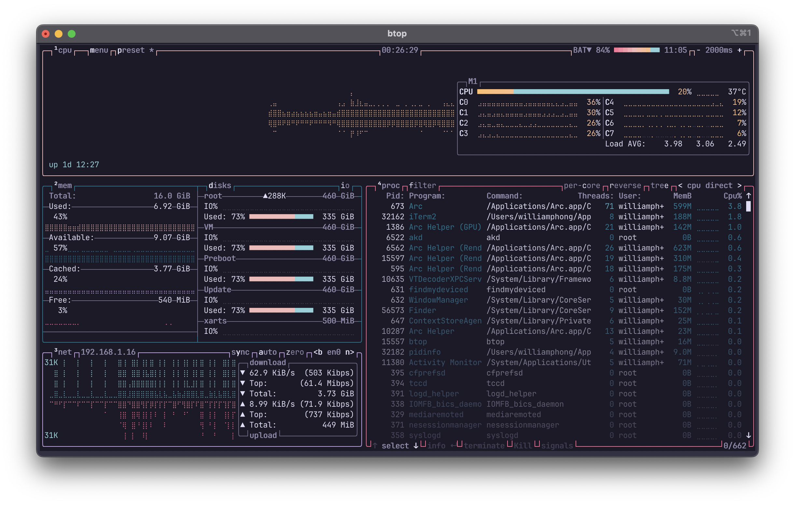
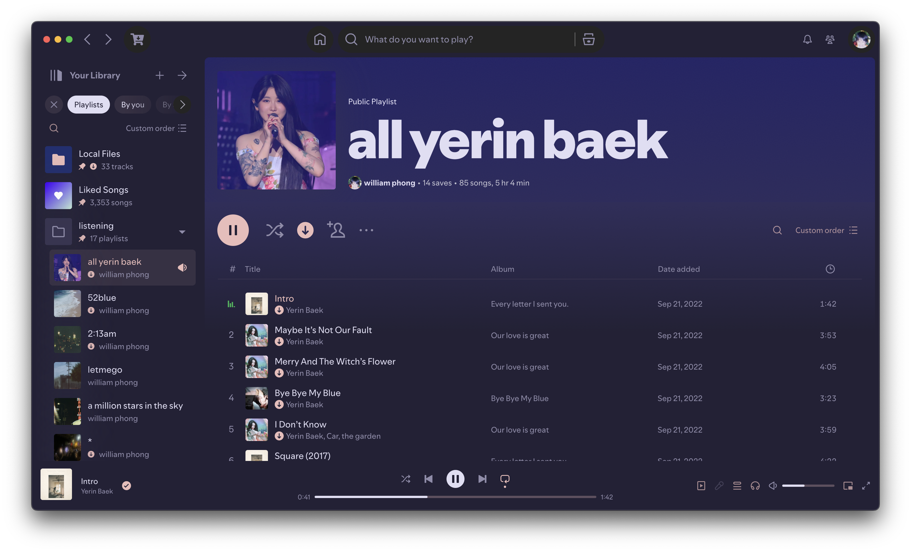

# dotfiles
these are my dotfiles that I use to setup my MacBook and Ubuntu server.

### Contents
- my [`MacOS`](#macos) setup, including my `kitty`, `zshrc`, and `powerlevel10k` configs, inspired by Huguesmmm
- my [`Linux`](#linux) setup, including my `bashrc`, `starship`, and `ble.sh` configs
- my [`NeoVim`](#neovim) setup utilizing `LazyVim`
- my [`Fastfetch`](#fastfetch) config
- my [`btop`](#btop) config
- my [`Spotify`](#spotify) setup
- my [`Tmux`](#tmux) setup with smart-splits and rose pine theme
- my [`lsd`](#lsd) config with rose pine colors

### Requirements
- [Neovim](https://neovim.io/) >= **v0.10.0**
- [LazyVim](https://www.lazyvim.org/)
- [JetBrainsMono Nerd Font](https://www.nerdfonts.com/)
- [Kitty](https://sw.kovidgoyal.net/kitty/) **_(macOS)_**
- [Tmux](https://github.com/tmux/tmux) >= **v3.0**
- [TPM](https://github.com/tmux-plugins/tpm) — Tmux Plugin Manager
- [lsd](https://github.com/Peltoche/lsd) — modern ls replacement
- [Fastfetch](https://github.com/fastfetch-cli/fastfetch)
- [btop](https://github.com/aristocratos/btop)
- [Spicetify](https://spicetify.app/)
- [Powerlevel10k](https://github.com/romkatv/powerlevel10k) **_(macOS)_**
- [Starship](https://starship.rs/) **_(Linux)_**
- [ble.sh](https://github.com/akinomyoga/ble.sh) **_(Linux)_**
- [zsh-syntax-highlighting](https://github.com/zsh-users/zsh-syntax-highlighting) **_(macOS)_**

## MacOS

- [`.zshrc`](https://github.com/williamphong/dotfiles/blob/main/.zshrc)
  - runs fastfetch on open
  - nvim default editor
  - enables p10k and zsh highlighting
- [`.p10k`](https://github.com/williamphong/dotfiles/blob/main/.p10k.zsh)
- [`/kitty`](https://github.com/williamphong/dotfiles/tree/main/.config/kitty) config, inspired by Huguesmmm
- [rose pine moon](https://github.com/williamphong/dotfiles/blob/main/.config/term_colors/rose-pine-moon.itermcolors) terminal theme

[return to top](#dotfiles)

## Linux

- [`.bashrc`](https://github.com/williamphong/dotfiles/blob/main/.bashrc)
  - runs fastfetch on open
  - nvim default editor
  - enables starship and ble.sh with prompt configuration
- [`starship.toml`](https://github.com/williamphong/dotfiles/blob/main/.config/starship.toml)
  - based on the original [rose pine](https://github.com/rose-pine/starship) starship theme
  - prompt is based on p10k

[return to top](#dotfiles)

## Neovim

- [`/nvim`](https://github.com/williamphong/dotfiles/tree/main/.config/nvim) configs

[return to top](#dotfiles)

## Fastfetch

- [`config.jsonc`](https://github.com/williamphong/dotfiles/blob/main/.config/fastfetch/config.jsonc)

[return to top](#dotfiles)

## btop

- [`/btop`](https://github.com/williamphong/dotfiles/tree/main/.config/btop) config
  - [rose pine](https://github.com/rose-pine/btop) btop theme

[return to top](#dotfiles)

## Spotify

- [`/spicetify`](https://github.com/williamphong/dotfiles/tree/main/.config/spicetify)
  - uses [spicetify](https://spicetify.app/) and the [rose pine](https://github.com/nicoleajoy/rose-pine-spotify) theme

[return to top](#dotfiles)

## Tmux
- [`/tmux`](https://github.com/williamphong/dotfiles/tree/main/.config/tmux) config
  - prefix set to `Ctrl-A`
  - mouse support enabled
  - windows and panes indexed from 1
  - splits open in current path (`|` horizontal, `-` vertical)
  - vi mode for copy mode
  - [rose pine](https://github.com/rose-pine/tmux) tmux theme
  - plugins managed by [TPM](https://github.com/tmux-plugins/tpm)
    - [tmux-sensible](https://github.com/tmux-plugins/tmux-sensible) — sane default settings
    - [smart-splits](https://github.com/mrjones2014/smart-splits.nvim) — seamless pane/neovim split navigation with `Ctrl+h/j/k/l` and resizing with `Alt+h/j/k/l`

[return to top](#dotfiles)

## lsd
- [`/lsd`](https://github.com/williamphong/dotfiles/tree/main/.config/lsd) config
  - replaces `ls` with [lsd](https://github.com/Peltoche/lsd)
  - custom rose pine color theme mapping:
    - files and permissions colored using rose pine palette (love, gold, foam, iris, pine, muted)
    - git status colors mapped to rose pine (foam for new, rose for modified, love for deleted)
    - file sizes and dates use foam/iris/subtle tones

[return to top](#dotfiles)

