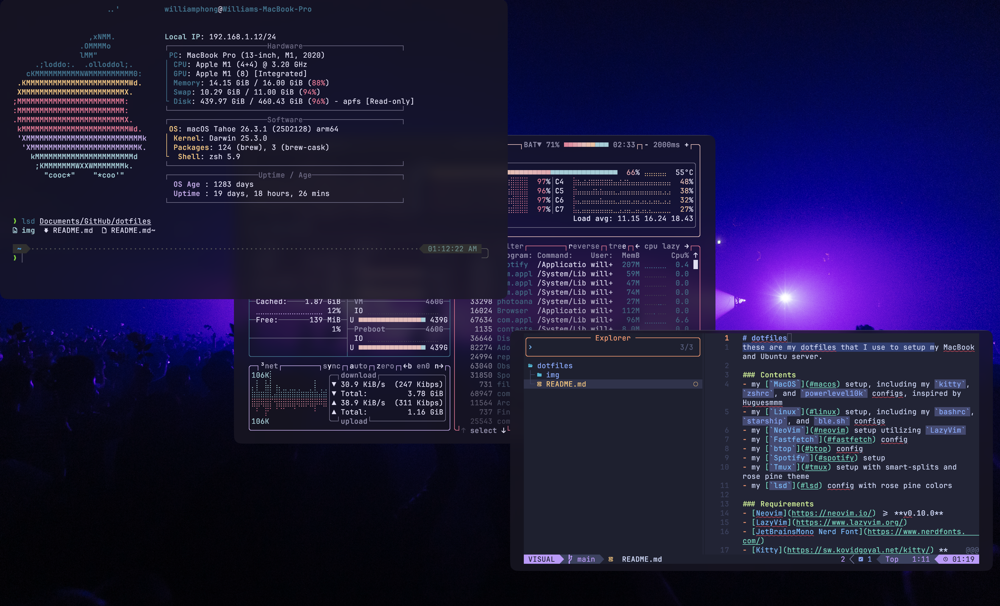
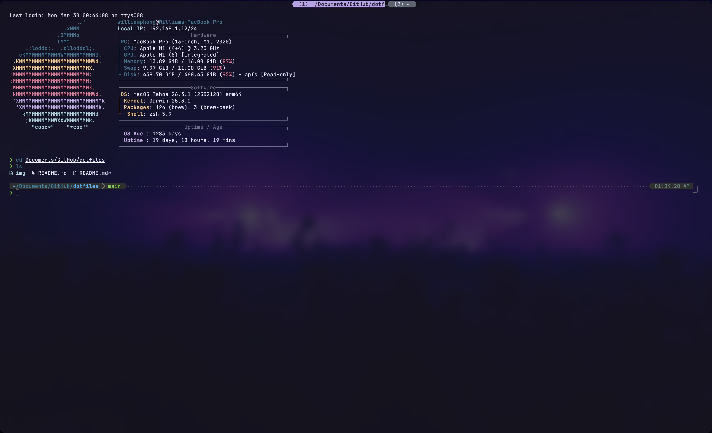
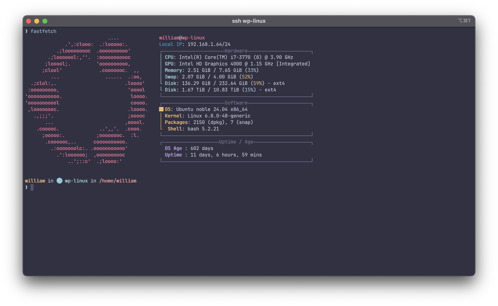
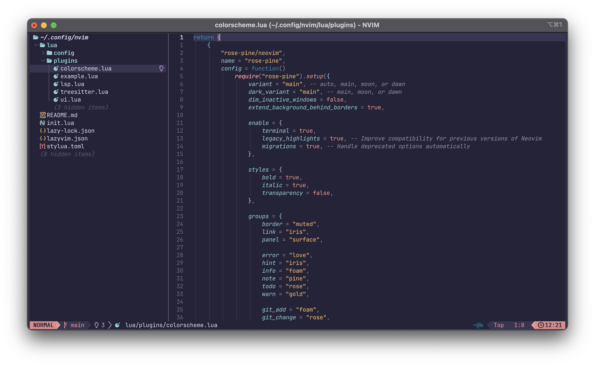
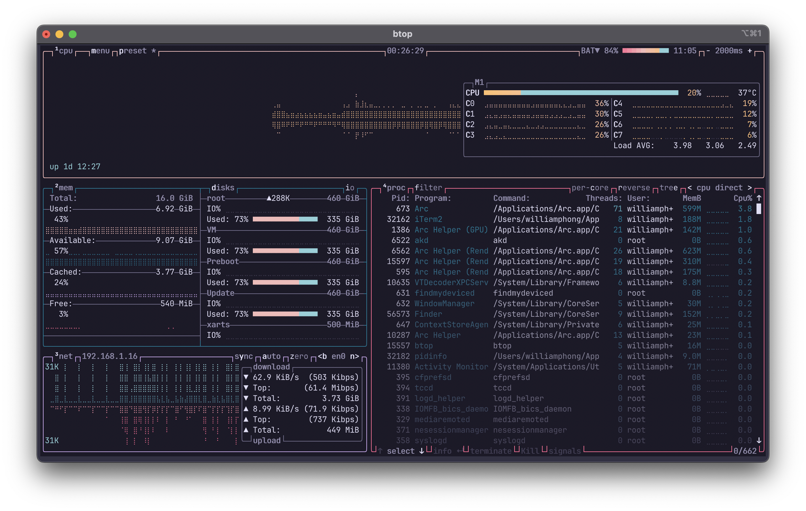

# dotfiles
these are my dotfiles that I use to setup my MacBook and Ubuntu server.


### Preview



### Contents
- my [`MacOS`](#macos) setup, including my `kitty`, `zshrc`, and `powerlevel10k` configs, inspired by Huguesmmm
- my [`Linux`](#linux) setup, including my `bashrc`, `starship`, and `ble.sh` configs
- my [`NeoVim`](#neovim) setup utilizing `LazyVim`
- my [`Fastfetch`](#fastfetch) config
- my [`btop`](#btop) config
- my [`Spotify`](#spotify) setup
- my [`Tmux`](#tmux) setup with smart-splits and rose pine theme
- my [`lsd`](#lsd) config with rose pine colors
- how configs are [`installed`](#install) and [`synced to servers`](#remote-servers)

### Install
```sh
git clone https://github.com/williamphong/dotfiles ~/Github/dotfiles
cd ~/Github/dotfiles
./install.sh
```

`install.sh` symlinks each config back to this repo, so editing the live config
and editing the repo are the same write and the two cannot drift apart. It is
idempotent, so re-run it after adding a new config. Anything already sitting at
a target is moved to `~/.dotfiles-backup/<timestamp>/` rather than overwritten;
`./install.sh --dry-run` shows what would change without touching anything.

Directories (`nvim`, `kitty`, `tmux`, `btop`, ...) are linked whole, so writes
an app makes next to its own config — btop rewriting `btop.conf` on exit, kitty
writing `current-theme.conf` — land in the repo instead of silently replacing a
file-level symlink with a regular file.

### Requirements
- [Neovim](https://neovim.io/) >= **v0.10.0**
- [LazyVim](https://www.lazyvim.org/)
- [JetBrainsMono Nerd Font](https://www.nerdfonts.com/)
- [Kitty](https://sw.kovidgoyal.net/kitty/) **_(macOS)_**
- [Tmux](https://github.com/tmux/tmux) >= **v3.0**
- [TPM](https://github.com/tmux-plugins/tpm) — Tmux Plugin Manager
- [lsd](https://github.com/Peltoche/lsd) — modern ls replacement
- [Fastfetch](https://github.com/fastfetch-cli/fastfetch)
- [btop](https://github.com/aristocratos/btop)
- [Spicetify](https://spicetify.app/)
- [Powerlevel10k](https://github.com/romkatv/powerlevel10k) **_(macOS)_**
- [Starship](https://starship.rs/) **_(Linux)_**
- [ble.sh](https://github.com/akinomyoga/ble.sh) **_(Linux)_**
- [zsh-syntax-highlighting](https://github.com/zsh-users/zsh-syntax-highlighting) **_(macOS)_**
- [zoxide](https://github.com/ajeetdsouza/zoxide) — smarter `cd` replacement
- [direnv](https://direnv.net/) — per-project environments, used for `pixi`
- [fnm](https://github.com/Schniz/fnm) — node version manager

## MacOS

- [`.zshrc`](https://github.com/williamphong/dotfiles/blob/main/.zshrc)
  - runs fastfetch on login shells
  - nvim default editor
  - enables p10k and zsh highlighting
  - zoxide enabled as a `cd` replacement
  - direnv for per-project environments, including `pixi`
  - `ssh`/`icat` wrap the kitty kittens, falling back to real `ssh` when not
    attached to kitty so scripted and piped calls keep working
- [`.p10k`](https://github.com/williamphong/dotfiles/blob/main/.p10k.zsh)
- [`/kitty`](https://github.com/williamphong/dotfiles/tree/main/.config/kitty) config, inspired by Huguesmmm
- [rose pine moon](https://github.com/williamphong/dotfiles/blob/main/.config/term_colors/rose-pine-moon.itermcolors) terminal theme


[return to top](#dotfiles)

## Linux

- [`.bashrc`](https://github.com/williamphong/dotfiles/blob/main/.bashrc)
  - mirrors [`.zshrc`](https://github.com/williamphong/dotfiles/blob/main/.zshrc):
    same history policy and sizes, same aliases, zoxide bound to `cd`, direnv
  - runs fastfetch on login shells only, not in every tmux pane
  - enables starship and ble.sh with transient prompt configuration
  - every block is guarded, so it degrades to a plain working shell on a
    server that has none of these tools installed — see [Remote servers](#remote-servers)
- [`starship.toml`](https://github.com/williamphong/dotfiles/blob/main/.config/starship.toml)
  - based on the original [rose pine](https://github.com/rose-pine/starship) starship theme
  - prompt is based on p10k

[return to top](#dotfiles)

## Remote servers
Connecting with `kitten ssh` copies these configs to the remote host, so a
fresh server behaves like the local machine without setting anything up by
hand. The copy list lives in
[`ssh.conf`](https://github.com/williamphong/dotfiles/blob/main/.config/kitty/ssh.conf):

| lands on the remote at | copied from |
| --- | --- |
| `~/.config/{nvim,lsd,tmux,fastfetch}`, `~/.config/starship.toml` | the same paths here |
| `~/.config/dotfiles/bashrc` | `.bashrc`, sourced via `KITTY_BASH_RCFILE` |
| `~/.local/bin/dotfiles-bootstrap` | `bootstrap.sh` |

Worth knowing:
- kitty copies **configs, not binaries**. On a host without starship, lsd, nvim
  or ble.sh, `.bashrc` falls back to a plain coloured prompt, `ls --color` and
  `vim`. Nothing errors — see [Provisioning a server](#provisioning-a-server).
- the remote's own `~/.bashrc` is **never touched**. bash has no `ZDOTDIR`, but
  kitty's shell integration reads `KITTY_BASH_RCFILE`, so the repo copy lands at
  `~/.config/dotfiles/bashrc` and is sourced from there — leaving a shared
  account's `.bashrc` alone. The system `/etc/bash.bashrc` is still sourced
  first, so distro setup survives.
- everything copied is **refreshed on every connect**, so don't hand-edit
  `~/.config/dotfiles/bashrc` on a server. Per-server changes go in
  `~/.bash_aliases`, which `.bashrc` sources and which is never copied.
- copy paths are resolved relative to `$HOME`, so anything listed in `ssh.conf`
  must be symlinked into `$HOME` by `install.sh` first.
- SSH keys are never copied. Use `ForwardAgent yes` per-host in `~/.ssh/config`
  so the private key stays on the Mac; `.bashrc` pins the forwarded agent
  socket to a stable path so it survives tmux reattaches.

### Provisioning a server
[`bootstrap.sh`](https://github.com/williamphong/dotfiles/blob/main/bootstrap.sh)
installs starship and ble.sh under `~/.local`, so it needs no root, and it is
idempotent — re-running only fills in what is missing.

```sh
# from the laptop, one or more hosts at once
./bootstrap.sh myserver anotherserver

# from inside a session, since it is copied to ~/.local/bin
# and .bashrc puts that on PATH
dotfiles-bootstrap
sh ~/.local/bin/dotfiles-bootstrap   # if the executable bit was not preserved
```

If the script is not there at all — you connected with plain `ssh` rather than
`kitten ssh`, hopped in from another host, or last connected before it was
added — fetch it straight from the repo instead:

```sh
curl -sS https://raw.githubusercontent.com/williamphong/dotfiles/main/bootstrap.sh | sh
```
```sh
wget -qO- https://raw.githubusercontent.com/williamphong/dotfiles/main/bootstrap.sh | sh
```

Being copied is not the same as being run. Nothing executes on connect and
nothing calls it from `.bashrc`: syncing config every time is cheap and
declarative, whereas fetching and executing installers is neither.

[return to top](#dotfiles)

## Neovim

- [`/nvim`](https://github.com/williamphong/dotfiles/tree/main/.config/nvim) configs

[return to top](#dotfiles)

## Fastfetch
- [`config.jsonc`](https://github.com/williamphong/dotfiles/blob/main/.config/fastfetch/config.jsonc)

[return to top](#dotfiles)

## btop

- [`/btop`](https://github.com/williamphong/dotfiles/tree/main/.config/btop) config
  - [rose pine](https://github.com/rose-pine/btop) btop theme

[return to top](#dotfiles)

## Spotify

- [`/spicetify`](https://github.com/williamphong/dotfiles/tree/main/.config/spicetify)
  - uses [spicetify](https://spicetify.app/) and the [rose pine](https://github.com/nicoleajoy/rose-pine-spotify) theme
  - only `config-xpui.ini` is tracked; themes, extensions and custom apps are
    third-party installs that spicetify fetches itself

[return to top](#dotfiles)

## Tmux
- [`/tmux`](https://github.com/williamphong/dotfiles/tree/main/.config/tmux) config
  - prefix set to `Ctrl-A`
  - mouse support enabled
  - windows and panes indexed from 1
  - splits open in current path (`|` horizontal, `-` vertical)
  - vi mode for copy mode
  - [rose pine](https://github.com/rose-pine/tmux) tmux theme
  - plugins managed by [TPM](https://github.com/tmux-plugins/tpm)
    - [tmux-sensible](https://github.com/tmux-plugins/tmux-sensible) — sane default settings
    - [smart-splits](https://github.com/mrjones2014/smart-splits.nvim) — seamless pane/neovim split navigation with `Ctrl+h/j/k/l` and resizing with `Alt+arrow keys`
    - [tmux-floax](https://github.com/omerxx/tmux-floax) — floating scratch pane
    - [tmux-resurrect](https://github.com/tmux-plugins/tmux-resurrect) — restores sessions, pane contents and nvim sessions
  - plugin checkouts are not tracked; TPM installs them on first run

[return to top](#dotfiles)

## lsd
- [`/lsd`](https://github.com/williamphong/dotfiles/tree/main/.config/lsd) config
  - replaces `ls` with [lsd](https://github.com/Peltoche/lsd)
  - custom rose pine color theme mapping:
    - files and permissions colored using rose pine palette (love, gold, foam, iris, pine, muted)
    - git status colors mapped to rose pine (foam for new, rose for modified, love for deleted)
    - file sizes and dates use foam/iris/subtle tones

[return to top](#dotfiles)

