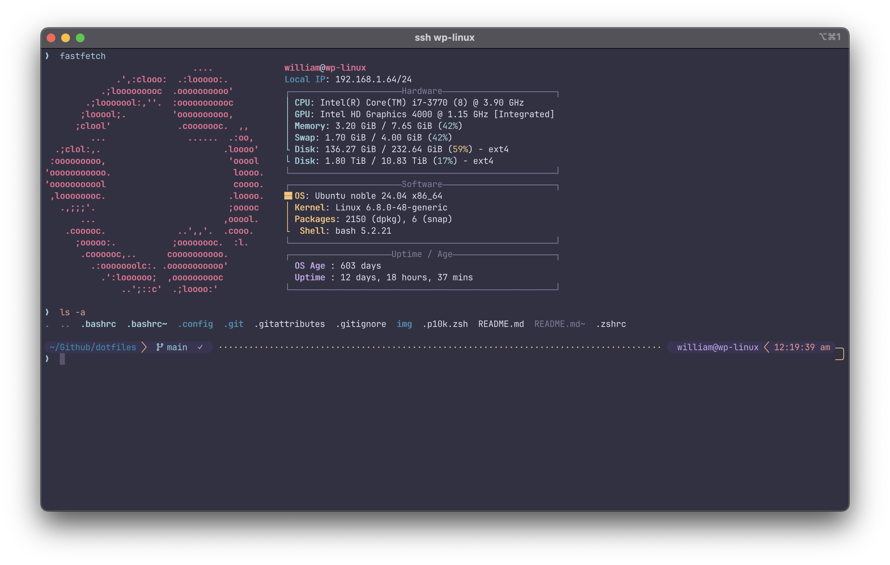

# dotfiles

these are my dotfiles that I use to setup my MacBook and Ubuntu server.

### Contents

- my [`iTerm2`](#iterm2) setup, including my `zshrc` and `powerlevel10k` configs
- my [`Linux`](#linux) setup, including my `bashrc`, `starship`, and `ble.sh` configs
- my [`NeoVim`](#neovim) setup utilizing `LazyVim`
- my [`Fastfetch`](#fastfetch) config
- my [`btop`](#btop) config
- my [`spotify`](#spotify) setup

### Requirements
- [Neovim](https://neovim.io/) >= **v0.10.0** 
- [LazyVim](https://www.lazyvim.org/)
- [JetBrainsMono Nerd Font](https://www.nerdfonts.com/)
- [iterm2](https://iterm2.com/) **_(Macos)_**

## iTerm2

- [`.zshrc`](https://github.com/williamphong/dotfiles/blob/main/.zshrc)
  - runs fastfetch on open
  - nvim default editor
  - enables p10k and zsh highlighting
- [`.p10k`](https://github.com/williamphong/dotfiles/blob/main/.p10k.zsh)
- [rose pine moon](https://github.com/williamphong/dotfiles/blob/main/.config/term_colors/rose-pine-moon.itermcolors) theme
- iterm2 and p10k config still needs some edits lol

## Linux

- [`.bashrc`](https://github.com/williamphong/dotfiles/blob/main/.bashrc)
  - runs fastfetch on open
  - nvim default editor
  - enables starship and ble.sh with prompt configuration
- [`starship.toml`](https://github.com/williamphong/dotfiles/blob/main/.config/starship.toml)
    - based on the original [rose pine](https://github.com/rose-pine/starship) starship theme
    - prompt is based on p10k

## Neovim

- [`/nvim`](https://github.com/williamphong/dotfiles/tree/main/.config/nvim) configs

## Fastfetch

- [`config.jsonc](https://github.com/williamphong/dotfiles/blob/main/.config/fastfetch/config.jsonc) 

## btop

- [`/btop`](https://github.com/williamphong/dotfiles/tree/main/.config/btop) config
  - [rose pine](https://github.com/rose-pine/btop) btop theme

## Spotify

- [`/spicetify`](https://github.com/williamphong/dotfiles/tree/main/.config/spicetify)
  - uses [spicetify](https://spicetify.app/) and the [rose pine](https://github.com/nicoleajoy/rose-pine-spotify) theme
 
[return to top](#dotfiles)

